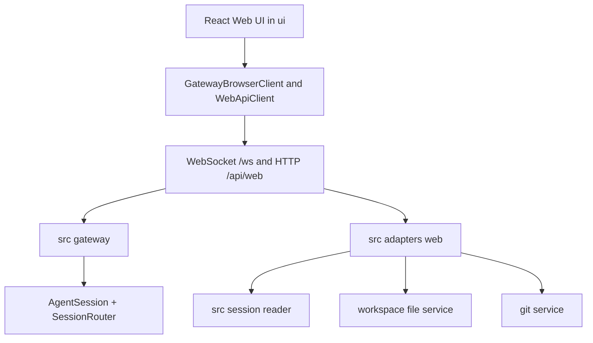
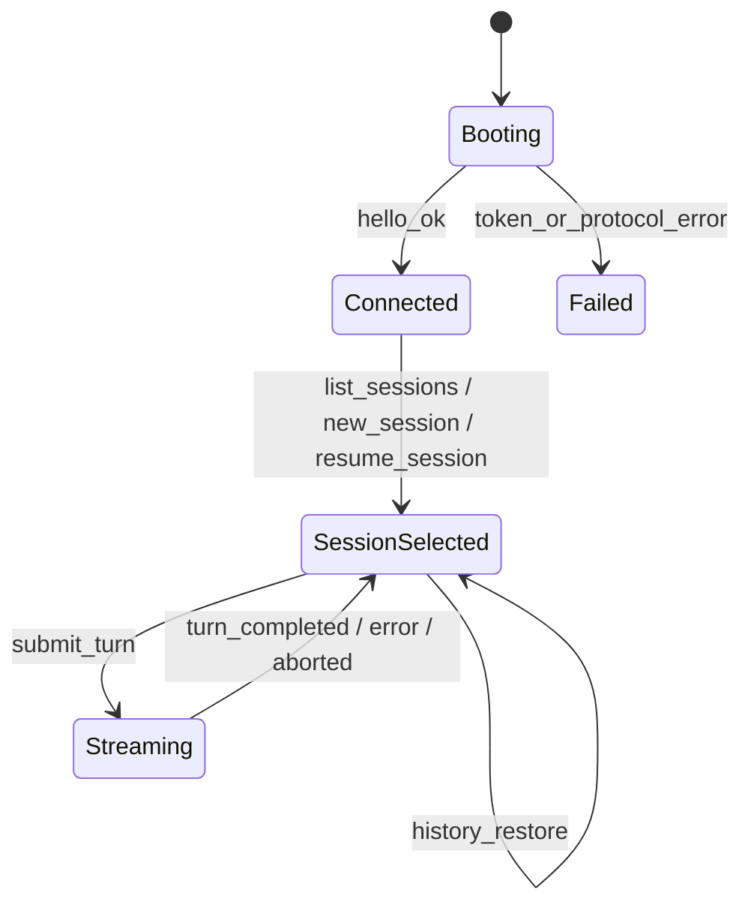
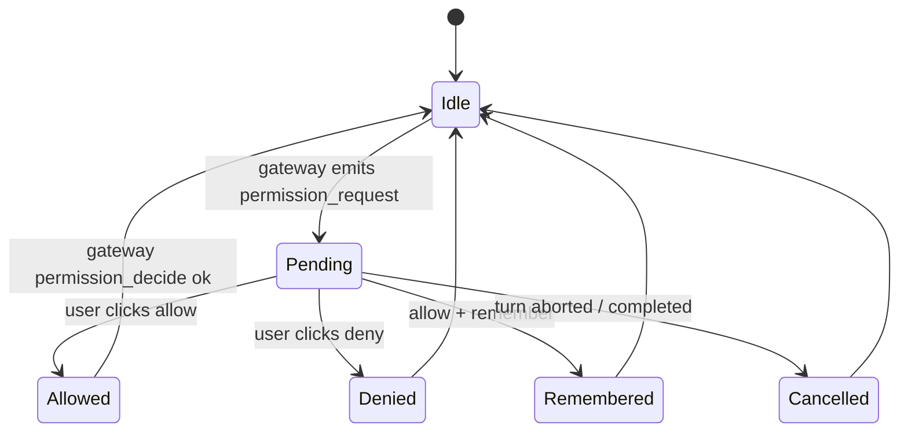

# Web UI 复刻开发文档

本文为 `/Users/miwi/PolitDeck/ui` Web UI 复刻 `old_ui` 前端能力的实施指南。后端运行时锁定为 `/Users/miwi/PolitDeck/src/gateway` + 少量补齐的 Web-facing contracts，禁止 React 直接依赖 `src/agent` / `src/tool` / `src/session/transcript` 内部或旧 Express provider 后端。

阅读顺序：先 `01-old-ui-current-state/`，再 `02-src-adaptation-plan/`，最后本文 + `02-web-ui-parity-test-guide.md`。

## 目标与边界

目标：在 `ui/` 复刻 old UI 用户可见能力（Chat/Files/Git/Always-On/Cron/Settings/Skills/Memory/Plugins/MCP/Shell/Tasks），并使行为可在 contract + dual parity 下证明。

边界：

- Web UI 经 `GatewayBrowserClient` 调用 `src/gateway` WebSocket。
- Files/Git/Projects/Always-On 通过 Gateway 新方法或 HTTP Web adapter，由 `src/cli/pilotdeckServer.ts` 装配。
- `session.transcript` 为事实来源；UI 仅缓存渲染状态。
- localStorage 用 `pilotdeck.*` 命名空间，避免污染旧 key。
- 未跑 dual parity 不得声称 behavior parity passed。

## 现状基线

`ui/`：Vite + React 19 单页 demo，仅实现 `submit_turn` 流式接收、`assistant_text_delta` 渲染（其它事件渲染为 `[type]` 占位）。

`src/gateway` 已具备：
- WebSocket `/ws` 帧协议（hello/hello_ok/request/response/event）。
- `submit_turn`、`abort_turn`、`list_sessions`、`new_session`、`resume_session`、`close_session`、`describe_server`、`cron_*`、`elicitation_respond`。
- Static assets serving via `staticAssetsPath`，已指向 `ui/dist`。

`src` 仍缺：项目列表/描述、Web 消息读取（合并 delta 的可读 history DTO）、permission decision 闭环、文件树/读写、Git status/diff/commit、Always-On 状态/历史/log。

## 目标架构



### UI 分层

```
ui/src/
  app/                 入口、shell、theme、错误边界
  router/              页面路由（Chat / Files / Git / Cron / Always-On / Settings / 占位 tab）
  gateway/             GatewayBrowserClient、frames 类型、stream manager
  api/                 WebApiClient (fetch /api/web/*)
  domain/              Project / Session / WebMessage / Permission / Cron 等 DTO 类型
  state/               session store、message reducer、preferences
  features/
    chat/              composer、message list、tool/permission/elicitation/error 视图
    projects/          项目列表、当前项目、新建/选择
    files/             文件树、reader、editor、上传、删除等
    git/               status/diff/commit/branch/remote
    cron/              cron CRUD（基础可 compare）+ deferred 入口
    always-on/         Discovery/run history（deferred 入口）
    settings/          模型 / 权限模式 / UI 偏好 / config diagnostics
    deferred/          Memory / Skills / Plugins / MCP / Shell / Tasks 占位
  styles.css           全局样式
```

每个 feature 必须导出一个 hook + container 组件。container 不直接 import `gateway-browser-client`，统一通过 `state` 层。

### 后端分层

```
src/
  gateway/
    protocol/          types.ts/frames.ts —— 新增方法和事件在此扩展
    client/            InProcessGateway / RemoteGateway —— 新方法的 default 委托
    server/            GatewayWsConnection 处理新 WS 方法；GatewayServer 增加 /api/web HTTP 路由
  adapters/web/        Web HTTP adapter：projects/files/git/always-on，统一 workspace root 校验
  cli/createLocalGateway.ts  装配 web adapter 的服务依赖（项目根、文件服务、git 服务）
  session/web/         WebMessage DTO + transcript→Web replay 合并逻辑
  permission/web/      permission decision 闭环（与 elicitation 类似）
```

新增前必须：
1. 协议字段先进 `types.ts` / `frames.ts`，附 contract 测试。
2. server 端实现 + workspace root 校验 + 错误码。
3. ui client 增加 helper。
4. UI feature 组件接入。
5. 写 contract 测试，必要时加 dual parity scenario。

## 协议草案

### Gateway WebSocket 方法（在 `WsGatewayMethod` 增加）

| 方法 | 用途 | Phase |
| --- | --- | --- |
| `read_session_messages` | 读取 session 历史，返回 `WebMessage[]` 分页 | 2 |
| `permission_decide` | Web 提交 allow/deny/remember | 2 |
| `list_projects` | 列出已知项目（chat dir 扫描或 explicit registry） | 3 |
| `describe_project` | 获取单项目摘要（path、sessions、cron、always-on 状态） | 3 |
| `rename_session` / `delete_session` | 会话管理 | 3 |
| `terminal_*`（可选） | 中期 Gateway terminal extension | 5 |

### 事件（在 `GatewayEvent` 增加）

- 已有事件保留，无破坏变更。
- 第 5 阶段如做终端，补 `terminal_event`。

### HTTP `/api/web/*`（GatewayServer 内挂载）

| 路径 | 方法 | 用途 |
| --- | --- | --- |
| `/api/web/projects` | GET | 列项目 |
| `/api/web/projects/:id` | GET | 项目详情 |
| `/api/web/projects/:id/files/tree` | GET | 文件树 |
| `/api/web/projects/:id/files/read` | GET | 读文件（query `path`） |
| `/api/web/projects/:id/files/write` | POST | 写文件 |
| `/api/web/projects/:id/files/create` | POST | 创建 |
| `/api/web/projects/:id/files/rename` | POST | 重命名 |
| `/api/web/projects/:id/files` | DELETE | 删除（query `path`） |
| `/api/web/projects/:id/git/status` | GET | git status |
| `/api/web/projects/:id/git/diff` | GET | git diff（query `path?`） |
| `/api/web/projects/:id/git/branches` | GET | branch 列表 |
| `/api/web/projects/:id/git/commit` | POST | commit（permission gated） |

所有路径都需 `Authorization: Bearer <local-token>`，否则 401。workspace root 在服务端校验，禁止 `..` 越界。

### `WebMessage` DTO

```ts
type WebMessageRole = "user" | "assistant" | "tool" | "system" | "permission" | "error";
type WebMessageKind =
  | "text"
  | "thinking"
  | "tool_use"
  | "tool_result"
  | "permission_request"
  | "elicitation_request"
  | "status"
  | "complete"
  | "interrupted"
  | "error"
  | "structured_output";

type WebMessage = {
  id: string;
  sessionKey: string;
  projectKey?: string;
  createdAt: string;
  provider: "pilotdeck" | (string & {});
  role: WebMessageRole;
  kind: WebMessageKind;
  toolCallId?: string;
  toolName?: string;
  requestId?: string;
  ok?: boolean;
  text?: string;
  payload?: unknown;
  source: "live" | "history";
  finishReason?: string;
  usage?: Record<string, number>;
};
```

合并规则：
- 历史读取把同一 turn 的连续 `assistant_text_delta` 合并成一个 `text` message。
- live 流式中也按 turn 合并（同一 turn 的 delta 累积进当前 assistant 消息）。
- tool started/finished 通过 `toolCallId` 配对；finished 写入同一 message 的 `ok` 与 `payload.resultPreview`。
- permission_request / elicitation_request 单独保留并附 `requestId`。
- error / interrupted / complete 保留为独立消息以便 UI 渲染最终状态。

## Phase 拆解

| Phase | 主要交付 | 必备验收 |
| --- | --- | --- |
| 0 冻结 | docs + fixtures + parity 矩阵 | scenario 列表落到 `tests/fixtures/web-ui/` |
| 1 客户端 | 完整 GatewayBrowserClient + 类型同步 | `tests/web-ui-client/*.test.ts` 通过 |
| 2 Chat | session lifecycle + Web reducer + history restore + permission/elicitation | `tests/gateway/web-read-session-messages.test.ts` + `tests/permission/web-permission-decide.test.ts` |
| 3 Project/Session 管理 | list_projects / describe_project / rename / delete | contract 测试 |
| 4 Files/Git | workspace-safe REST + UI panels | tests/adapters/web/files+git contract |
| 5 Cron / Always-On / Settings / Deferred 占位 | UI 入口 + 已有 cron 接入 + 占位文案 | UI 单测覆盖入口可见性 |

## Web UI 关键状态机

### Session lifecycle



### Permission decision



## localStorage 命名迁移

| 旧 key | 新 key | 状态 |
| --- | --- | --- |
| `auth-token` | 不再使用，token 仅由 `/auth/local-token` 临时拉取 | intentional_difference |
| `selected-provider` | 不迁移；provider 由 PilotDeck config 决定 | intentional_difference |
| `permissionMode-${sessionId}` | `pilotdeck.permissionMode.${sessionKey}` | compare |
| `activeTab` | `pilotdeck.ui.activeTab` | compare |
| `uiPreferences` | `pilotdeck.ui.preferences` | compare |
| `theme` | `pilotdeck.ui.theme` | compare |
| sidebar 宽度/折叠 | `pilotdeck.ui.sidebar.*` | compare |

UI 在第一次启动时尝试读旧 key 并迁移到新 key（仅一次），随后写入新 key。

## 事件 → WebMessage 映射表

| GatewayEvent | role | kind | 说明 |
| --- | --- | --- | --- |
| `turn_started` | system | status | UI 显示“running” |
| `assistant_text_delta` | assistant | text | 累积到当前 assistant message |
| `assistant_thinking_delta` | assistant | thinking | 单独流，UI 折叠展示 |
| `tool_call_started` | tool | tool_use | 创建 tool message + activity |
| `tool_call_finished` | tool | tool_result | 配对 toolCallId，写 ok/preview |
| `permission_request` | permission | permission_request | 弹 banner 等 decide |
| `elicitation_request` | system | elicitation_request | 弹 modal 等 respond |
| `elicitation_cancelled` | system | status | 关闭 modal，UI 提示已取消 |
| `structured_output` | system | structured_output | 渲染 JSON viewer |
| `plan_mode_changed` | system | status | 更新 mode badge |
| `turn_completed` | system | complete | 标 turn 完成 |
| `error` | error | error | 显示错误，依据 `recoverable` 决定是否中断 |

## 风险与决策点

- **过早做 UI**：先稳定事件流。若发现需要 UI state 推进 runtime，停下补 Gateway 协议而非反向耦合。
- **类型漂移**：`ui/src/gateway/` 的 `GatewayEvent` 必须对齐 `src/gateway/protocol/types.ts`。我们通过共享类型文件的 *拷贝 + 测试断言* 保证一致（不能 import `src/`，因为 `ui` 是浏览器 bundle）。
- **非 localhost auth**：当前只支持 localhost binding；远程访问需要新认证方案，**不在第一阶段。**
- **旧 provider 历史**：迁移期间允许只读展示旧 provider 转写消息，需要在 fixture 标 `intentional_difference`。

## 落地文件参考

- 开发指南：本文。
- 测试指南：`02-web-ui-parity-test-guide.md`。
- 行为冻结 fixtures：`tests/fixtures/web-ui/`。
- 旧 UI 行为来源：`docs/old-ui-adaptation/01-old-ui-current-state/`。
- 适配边界：`docs/old-ui-adaptation/02-src-adaptation-plan/`。
- Parity 矩阵：`docs/old-ui-adaptation/02-src-adaptation-plan/04-parity-matrix.md`。
